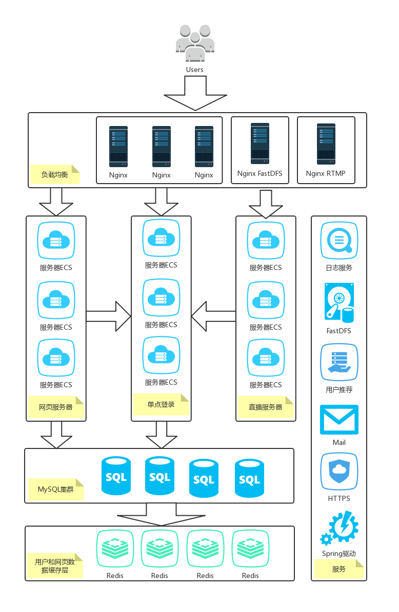
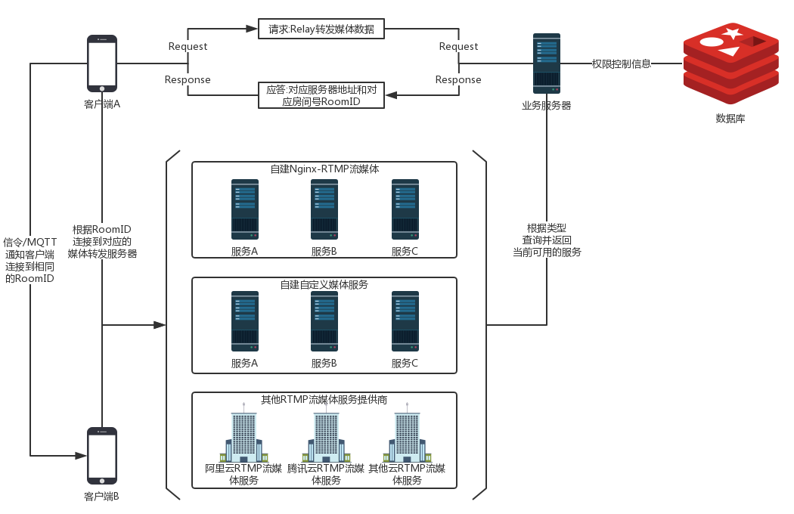
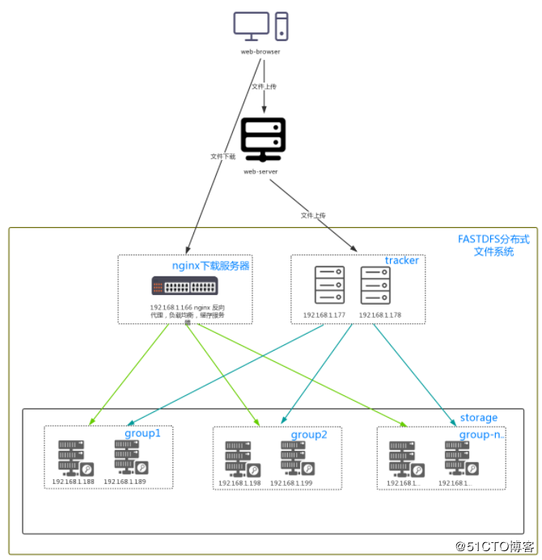

# NebulaMOOC

**一个基于B/S架构及分布式的大型在线慕课交流平台，包括了课程、讨论区、直播三大模块**

网址（请忽略SSL证书的警告）：https://119.23.63.134  

目前只对Chrome浏览器兼容

项目整体基于SprintBoot 2.1.5，同时基于GRPC远程调用服务和Spring AOP作为日志系统，包括实现了基于Redis缓存的单点登录系统，基于Netty、Protobuf、WebSocket的直播服务器，基于Redis、Spring Web的网页服务器。  

下面为整体架构图：

Nginx RTMP服务器架构图：

FastDFS文件服务器架构图：

